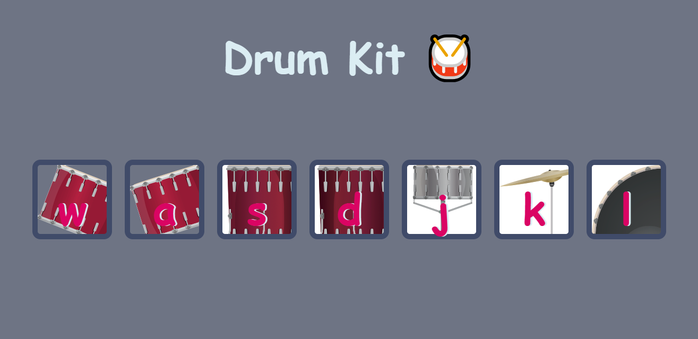

# Drum Kit 🥁

Welcome to the Drum Kit project! This is a simple web-based drum kit application where you can play drum sounds by clicking buttons or pressing keys on your keyboard.

## Demo

## Features

- **Interactive Buttons**: Click the buttons on the screen to play different drum sounds.
- **Keyboard Support**: Use your keyboard to play the drum sounds.
- **Visual Feedback**: Buttons give visual feedback when pressed.

## Technologies Used

- **HTML**: Structure of the webpage.
- **CSS**: Styling of the webpage.
- **JavaScript**: Functionality for playing sounds and handling user interactions.

## How to Use

1. **Open the Application**: Open the `index.html` file in your web browser.
2. **Click the Buttons**: Click any of the drum buttons (`w`, `a`, `s`, `d`, `j`, `k`, `l`) to play the corresponding drum sound.
3. **Use the Keyboard**: Press the keys (`w`, `a`, `s`, `d`, `j`, `k`, `l`) on your keyboard to play the drum sounds.

## Acknowledgements
Inspired by the Drum Kit Challenge from Angela Yu's Web Development Bootcamp.

